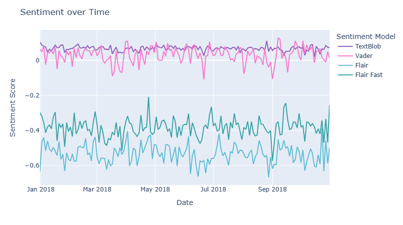

# Geographic Sentiment Analysis of Reddit Data
This dashboard is created in support of the Applied Data Science coursework. It displays the sentiment distribution of comments within the `r/Europe' community on the social media platform *Reddit*, with specific emphasis on how sentiment varies based on the author's national identity. A dataset containing over 65,000 comments is produced, which is then analyzed under different sentiment models. Metrics are gathered for the undirected (posted from a country) and directed (posted toward a country) sentiment for these comments. Topic Modelling and Named Entity Recognition are carried out to allow visualisation of sentiment based on specific topics or towards entities.


## Table of Contents
- [Dashboard](#dashboard)
- [Usage](#usage)

# Dashboard - [link to full video demo](https://uob-my.sharepoint.com/:v:/g/personal/fy20856_bristol_ac_uk/EZu-SdbiKeFLtZJxxV8NWZgBClyL2PSqqOmKul_PeWyDbQ?nav=eyJyZWZlcnJhbEluZm8iOnsicmVmZXJyYWxBcHAiOiJPbmVEcml2ZUZvckJ1c2luZXNzIiwicmVmZXJyYWxBcHBQbGF0Zm9ybSI6IldlYiIsInJlZmVycmFsTW9kZSI6InZpZXciLCJyZWZlcnJhbFZpZXciOiJNeUZpbGVzTGlua0NvcHkifX0&e=vQGpWw)
> Choropleth of directed (mention) sentiment with VADER model

## Choropleth with hover information about sentiment:


## Change sentiment model:


## Change topics:


## Change sentiment type:


## Sentiment and emotion timeseries:



## Sentiment and emotion timseries for chosen country:


## Correlation of sentiment models animation:


## Random subset of comments:


# Usage

Provide instructions on how to install the project and its dependencies. Include any necessary commands or steps.

```bash
pip install my_project
```
> [!WARNING]
> The dashboard is quite slow, please be patient. For a sped-up, full demo of its capabilities see [this video](https://uob-my.sharepoint.com/:v:/g/personal/fy20856_bristol_ac_uk/EZu-SdbiKeFLtZJxxV8NWZgBClyL2PSqqOmKul_PeWyDbQ?nav=eyJyZWZlcnJhbEluZm8iOnsicmVmZXJyYWxBcHAiOiJPbmVEcml2ZUZvckJ1c2luZXNzIiwicmVmZXJyYWxBcHBQbGF0Zm9ybSI6IldlYiIsInJlZmVycmFsTW9kZSI6InZpZXciLCJyZWZlcnJhbFZpZXciOiJNeUZpbGVzTGlua0NvcHkifX0&e=vQGpWw).
